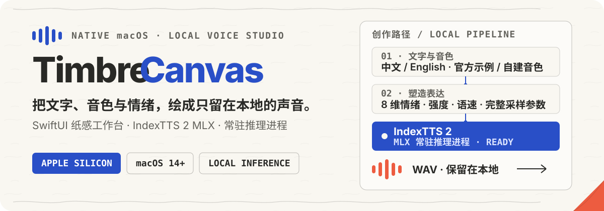

<p align="center">
  
</p>

<p align="center">
  <strong>本地优先的原生 macOS 语音创作工具</strong><br>
  从音色管理、表达塑造到结果播放，都在一张纸感 SwiftUI 画布里完成。
</p>

<p align="center">
  <a href="#开始使用">开始使用</a> ·
  <a href="docs/使用说明.md">使用说明</a> ·
  <a href="PRIVACY.md">隐私</a> ·
  <a href="THIRD_PARTY_MODELS.md">模型许可</a>
</p>

---

TimbreCanvas 将文字、音色、情绪和完整生成参数放进一个原生 macOS 工作台。App 通过常驻进程调用安装在仓库外的 IndexTTS 2 MLX 运行时；模型权重、用户音色和生成音频不会进入这个仓库。

## 创作，不只是“输入文字”

- **塑造表达** — 调整 8 维情绪、情绪强度、语速，以及温度、Top P、Top K、扩散步数、CFG 等完整生成参数。
- **建立音色库** — 使用官方示例音色，或从本地参考音频提取自己的音色；支持搜索、重命名和删除。
- **复用整套声音配置** — 将音色、情绪、语速和高级参数保存为预设，一次恢复完整创作状态。
- **保持创作连续** — 常驻推理进程避免每次生成都重新载入模型；生成结果可直接播放并在 Finder 中定位。
- **保留模型选择空间** — 引擎能力通过中立接口暴露，当前适配 IndexTTS 2，也为其他本地 TTS 引擎保留接入位置。

## 从一句话到本地音频

1. **选择音色** — 从官方示例开始，或导入已获授权的参考音频。
2. **写下内容** — 支持中文和英文文本。
3. **调整表达** — 选择情绪、强度、语速；需要时再展开高级采样参数。
4. **生成与试听** — 常驻 worker 在本地完成推理，结果写入你选择的目录。

> [!NOTE]
> 正常推理配置为离线运行；网络仅用于安装脚本下载声明并锁定版本的运行时与模型资产。TimbreCanvas 不提供账号、遥测、广告或崩溃日志上传。

## 开始使用

### 系统要求

- Apple Silicon Mac
- macOS 14 或更高版本
- 16 GB 统一内存起步，推荐 24 GB 或更多
- 首次安装建议预留至少 20 GB 空间
- Xcode Command Line Tools（用于从源码构建 App）

> [!IMPORTANT]
> 外部模型不受本仓库 MIT License 覆盖，其中部分组件包含非商业或其他使用限制。安装前请先阅读 [外部运行时与模型许可说明](THIRD_PARTY_MODELS.md)。

克隆仓库后运行：

```bash
./script/setup.sh
```

安装脚本会先展示外部模型许可证，然后检查本机环境、下载并校验固定版本资产、在本机转换 8-bit MLX 权重、准备官方示例音色，最后构建 App。默认安装位置是：

```text
$HOME/Applications/TimbreCanvas.app
```

<details>
<summary><strong>外置磁盘、已有运行时与更多安装选项</strong></summary>

把大型模型放在外置磁盘：

```bash
./script/setup.sh --install-root "/Volumes/ExternalAI/TimbreCanvas"
```

复用已经验证的 MLX-IndexTTS 项目：

```bash
./script/setup.sh --reuse-runtime "/path/to/mlx-indextts"
```

只查看固定版本的外部模型许可说明，不执行安装：

```bash
./script/setup.sh --show-model-licenses
```

查看完整参数：

```bash
./script/setup.sh --help
```

重复执行安装会刷新内置示例音色，但保留已有自定义音色及其名称。若 `voices.json` 已损坏，安装器和 App 都会拒绝覆盖原文件。

</details>

## 本地优先的边界

TimbreCanvas 不包含遥测、云端上传或账号系统。文本、导入音频、克隆音色、预设和生成结果都在本地处理和保存；本地配置使用仅当前用户可读写的权限。完整说明见 [PRIVACY.md](PRIVACY.md)。

声音克隆需要明确授权。请勿用克隆音色冒充他人，或用于欺骗、骚扰、监控及其他违法用途。

## 文档

- [中文使用说明](docs/使用说明.md) — 安装、主界面、音色、预设、参数、文件位置与常见问题
- [外部运行时与模型](THIRD_PARTY_MODELS.md) — 固定来源、许可证与再分发边界
- [安全政策](SECURITY.md) — 漏洞报告方式与已知上游风险
- [贡献指南](CONTRIBUTING.md) — 开发环境、检查项与公开安全要求

## 开发

```bash
swift test --package-path App
uvx --from ruff==0.15.6 ruff check RuntimeHost Installer
PYTHONPATH=RuntimeHost:Installer uvx --from pytest==9.0.3 pytest RuntimeHost/tests Installer/tests -q
./script/package_app.sh --debug
```

App 与运行时适配代码采用 [MIT License](LICENSE)。外部模型及运行时遵循各自许可证。

作者：[ZacharyJiao](https://github.com/ZacharyJiao)
